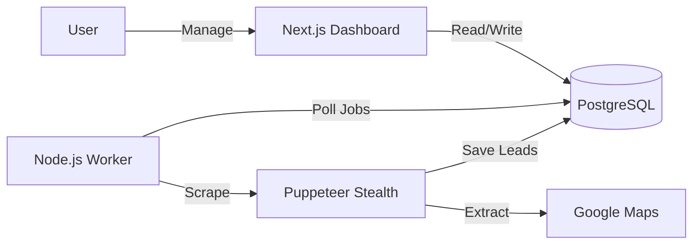

# 🐝 Swarm Lead Scraper

> **Automated B2B Lead Generation Engine**

Swarm Lead Scraper is a robust, production-ready B2B lead generation tool. It combines a Next.js Dashboard for management with a stealthy Node.js/Puppeteer worker for data extraction.

## 🏗️ Architecture



## 🛠️ Tech Stack

- **Frontend:** Next.js 16 (App Router), Tailwind CSS v4, Lucide React
- **Auth:** Clerk (Multi-tenancy)
- **Backend:** Node.js, Puppeteer (Stealth Plugin), Server Actions
- **Database:** PostgreSQL, Prisma ORM
- **Infrastructure:** Docker (for DB)

## 🚀 Quick Start

### 1. Prerequisites

- **Node.js** (v18+)
- **Docker Desktop** (must be running)
- **Clerk Account** (for authentication)

### 2. Setup

**1. Start Database**

```bash
docker compose up -d
```

**2. Configure Environment**

```bash
cp .env.example .env
# Fill in DATABASE_URL, OPENAI_API_KEY
```

**3. Install Dependencies**

```bash
npm install           # Root dependencies
npm install --prefix dashboard # Dashboard dependencies
```

**4. Initialize Database**

```bash
npx prisma migrate dev
```

### 3. Run Application

**Start the Worker (Scraper Engine):**

```bash
npm start
```

**Start the Dashboard (UI):**

```bash
npm run dev --prefix dashboard
```

Visit `http://localhost:3000` to access the dashboard.

## 📦 Project Structure

```
├── dashboard/        # Next.js Frontend
│   ├── src/app/      # App Router
│   └── src/actions/  # Server Actions
├── src/              # Scraper Worker
│   ├── scraper/      # Puppeteer Logic
│   └── services/     # Job Poller
├── prisma/           # Database Schema
└── docs/             # Documentation
```

## 📄 Documentation

- [Architecture Guide](docs/ARCHITECTURE.md)
- [Environment Variables](docs/ENVIRONMENT.md)
- [API Reference](docs/API_REFERENCE.md)
