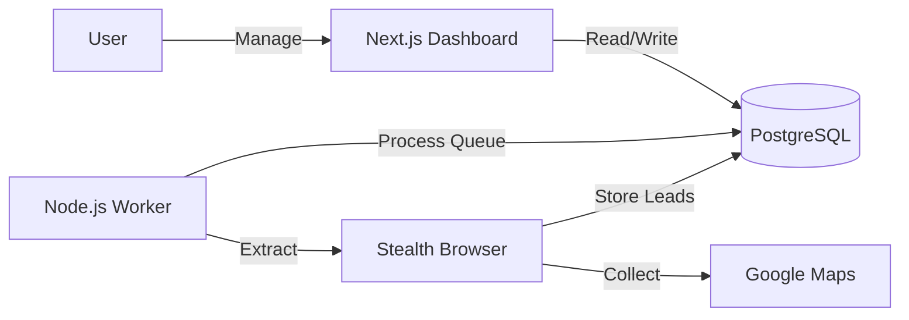

# Swarm | B2B Lead Intelligence Engine

Automated B2B lead intelligence platform that surfaces local business data, crawls websites for contact information, verifies emails via MX lookup, and assigns AI confidence scores. Processes 500+ companies per hour.


---

## What It Does

- **Surfaces business data** from Google Maps by niche and location
- **Crawls business websites** using stealth browser automation
- **Extracts and MX-verifies** email contacts
- **Assigns AI-powered confidence scores** via hybrid parsing (regex + LLM fallback)
- **Multi-tenant dashboard** with Clerk auth and Stripe monetization

---

## Architecture

Swarm uses a decoupled **"Bridge" pattern** — the Dashboard and Worker communicate exclusively via a PostgreSQL job queue. This keeps the UI responsive while the data collection engine runs independently.


```mermaid
graph LR
    User[User] -->|Manage| Dashboard[Next.js Dashboard]
    Dashboard -->|Read/Write| DB[(PostgreSQL)]
    Worker[Node.js Worker] -->|Process Queue| DB
    Worker -->|Extract| Stealth[Stealth Browser]
    Stealth -->|Collect| GMaps[Google Maps]
    Stealth -->|Store Leads| DB
```

---

## Tech Stack

| Layer | Technology |
|-------|-----------|
| **Frontend** | Next.js 16 (App Router), Tailwind CSS v4, Lucide React |
| **Auth** | Clerk (multi-tenancy) |
| **Backend** | Node.js, Puppeteer (Stealth Plugin), Server Actions |
| **Database** | PostgreSQL, Prisma ORM |
| **AI** | OpenAI GPT-4o-mini (hybrid email parsing) |
| **Payments** | Stripe (credits-based billing) |
| **Infrastructure** | Docker, PM2 |

---

## Quick Start

### Prerequisites

- **Node.js** (v18+)
- **Docker Desktop** (must be running)
- **Clerk Account** (for authentication)

### Setup

**1. Start Database**

```bash
docker compose up -d
```

**2. Configure Environment**

```bash
cp .env.example .env
# Fill in DATABASE_URL, OPENAI_API_KEY
```

**3. Install Dependencies**

```bash
npm install           # Root dependencies
npm install --prefix dashboard # Dashboard dependencies
```

**4. Initialize Database**

```bash
npx prisma migrate dev
```

### Run

**Start the Worker (Data Collection Engine):**

```bash
npm start
```

**Start the Dashboard (UI):**

```bash
npm run dev --prefix dashboard
```

Visit `http://localhost:3000` to access the dashboard.

---

## Project Structure

```
├── dashboard/          # Next.js Frontend (App Router)
│   ├── src/app/        # Routes & Server Actions
│   └── src/components/ # UI Components
├── src/                # Data Collection Worker
│   ├── scraper/        # Data Collection Engine (Puppeteer)
│   ├── services/       # Job Poller & Orchestration
│   ├── db/             # Prisma Database Operations
│   ├── utils/          # Hybrid Parser, Email Guesser, Logger
│   └── scripts/        # CLI Utilities & Diagnostics
├── prisma/             # Database Schema & Migrations
├── docs/               # Architecture & Reference Docs
└── docker-compose.yml  # Local Dev Stack
```

---

## Deployment

### Dashboard → Vercel

1. Import the repository into Vercel, set **Root Directory** to `dashboard`.
2. Configure environment variables (Clerk, Stripe, `DATABASE_URL`).
3. Deploy — Vercel runs `next build` automatically.

### Worker → VPS (Docker)

1. Copy project files to your server.
2. Create a `.env` file with production credentials.
3. Build and start:

```bash
docker-compose up --build -d
```

> Use a managed Postgres provider (Neon, Supabase, Railway). Run `npx prisma migrate deploy` after provisioning.

---

## Screenshots

> Screenshots coming soon. See [demo video](#) for a walkthrough.

---

## Documentation

- [Architecture Guide](docs/ARCHITECTURE.md)
- [Environment Variables](docs/ENVIRONMENT.md)
- [API Reference](docs/API_REFERENCE.md)

---

## License

This project is licensed under the [MIT License](LICENSE).

---

Built by **Nick Bokuchava** — [LinkedIn](https://linkedin.com/in/nika-bokuchava-7856b03b5) · [GitHub](https://github.com/mindmnml-del)
