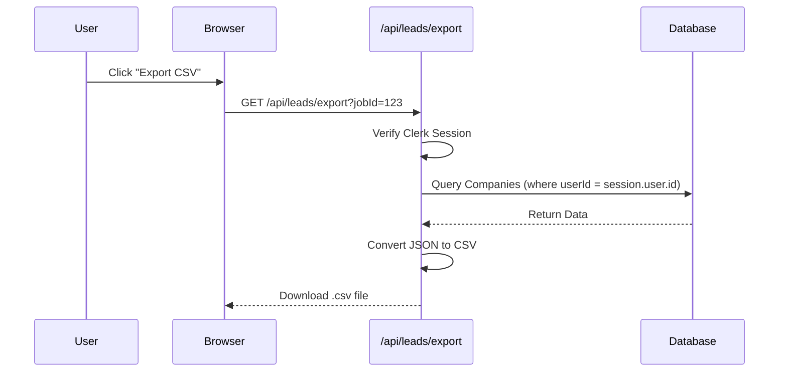

# 📡 API Reference (Internal)

Since this is a Next.js App Router project, we use **Server Actions** instead of a traditional REST API for most operations.

## Server Actions

Location: `dashboard/src/actions/`

### `createScrapeJob`

Initiates a new scraping task.

- **Input:**
  ```typescript
  {
    query: string; // e.g. "Dentists in New York"
    maxResults: number; // e.g. 20
  }
  ```
- **Output:** `ScrapeJob` object
- **Auth:** Protected (Requires active Clerk session)

### `getRecentJobs`

Retrieves a list of recent jobs for the current user.

- **Input:** None (Infers `userId` from session)
- **Output:** Array of `ScrapeJob`
- **Auth:** Protected

---

## Route Handlers

Location: `dashboard/src/app/api/`

### Export Leads

**GET** `/api/leads/export`

Downloads a CSV file of leads for a specific job or all user leads.

- **Query Parameters:**
  - `jobId` (optional): ID of the job to export. If omitted, exports all leads for the user.
- **Response:** `text/csv` file attachment.
- **Auth:** Protected (Checks `userId` ownership of data).

---

## Data Flow Diagram (Export)


