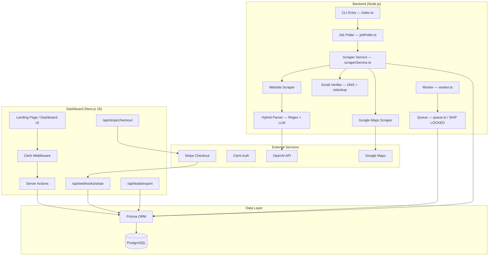

# 🩺 Codebase Health Audit Report

> **Generated:** 2026-02-19  
> **Scope:** Full-stack audit of Swarm Lead Scraper (Backend + Dashboard + Infrastructure)  
> **Methodology:** Sequential multi-agent analysis (Explorer → Test Engineer → Security Auditor → Backend Specialist)

---

## Executive Summary

The Swarm Lead Scraper is a **functional MVP** with a solid architecture for its current scale — a Next.js 16 dashboard backed by a Node.js/Puppeteer scraping engine, PostgreSQL via Prisma, Clerk auth, and Stripe monetization. However, the codebase has accrued **significant technical debt** that will become bottlenecks at scale.

**Key Headline Findings:**

| Category     | Critical (P0) | High (P1) | Medium (P2) |
| ------------ | :-----------: | :-------: | :---------: |
| Security     |       2       |     3     |      2      |
| Stability    |       1       |     2     |      3      |
| Architecture |       1       |     3     |      4      |
| Testing      |       1       |     2     |      1      |
| **Total**    |     **5**     |  **10**   |   **10**    |

---

## Current Architecture & Data Flow



### File Inventory

| Layer                        | Files | Key Modules                                                                                                                      |
| ---------------------------- | :---: | -------------------------------------------------------------------------------------------------------------------------------- |
| Backend (`src/`)             |  23   | `worker.ts`, `scraperService.ts`, `googleMapsScraper.ts`, `websiteScraper.ts`, `hybridParser.ts`, `emailVerifier.ts`, `queue.ts` |
| Dashboard (`dashboard/src/`) |  35+  | Server Actions, API Routes (3), Components (14), Middleware                                                                      |
| Tests (`tests/`)             |   3   | `hybridParser.test.ts`, `scraper.test.ts`, `test_deep_crawl.ts`                                                                  |
| Schema                       |   1   | `prisma/schema.prisma` (4 models: Company, Contact, ScrapeJob, User)                                                             |

---

## Critical Weaknesses & Vulnerabilities

### 🔴 P0 — Critical (Fix Before Production)

---

#### SEC-01: Command Injection in Email Verifier

**File:** [emailVerifier.ts](file:///d:/LEADS2/swarm-lead-scraper/src/services/emailVerifier.ts#L50-L55)  
**Severity:** 🔴 CRITICAL

The `verifyEmail` function passes user-derived email domain data directly to `child_process.exec` via `nslookup`/`dig` without any sanitization:

```typescript
// Line 50-55 — domain comes from scraped email
const command =
  process.platform === "win32"
    ? `nslookup -type=mx ${domain}` // ← NOT SANITIZED
    : `dig +short MX ${domain}`;
const { stdout, stderr } = await execAsync(command);
```

A malicious website could embed a crafted email like `test@evil.com;rm -rf /` in its HTML. The domain would be extracted and injected directly into a shell command.

> [!CAUTION]
> **Fix:** Validate `domain` against a strict DNS hostname regex (e.g. `/^[a-zA-Z0-9.-]+$/`) before passing to `exec`, or switch to `resolveMx` exclusively with better error handling.

---

#### SEC-02: Stripe Checkout `priceId` Spoofing

**File:** [checkout/route.ts](file:///d:/LEADS2/swarm-lead-scraper/dashboard/src/app/api/stripe/checkout/route.ts#L12-L14)  
**Severity:** 🔴 CRITICAL

The checkout endpoint blindly trusts the `priceId` and `credits` values from the client request body:

```typescript
const { priceId, credits } = await request.json();
```

An attacker could send `credits: 999999` with a valid but cheap `priceId`, and when the webhook fires, the server would credit 999,999 credits for a $19 payment.

> [!CAUTION]
> **Fix:** Map `priceId → credits` on the server side. Define an allowlist:
>
> ```typescript
> const PRICE_MAP: Record<string, number> = {
>   price_starter_id: 1000,
>   price_growth_id: 5000,
>   price_agency_id: 15000,
> };
> const credits = PRICE_MAP[priceId];
> if (!credits)
>   return NextResponse.json({ error: "Invalid plan" }, { status: 400 });
> ```

---

#### ARC-01: Three Separate PrismaClient Instances

**Files:**

- [src/db/company.ts:3](file:///d:/LEADS2/swarm-lead-scraper/src/db/company.ts#L3) — `const prisma = new PrismaClient();`
- [src/db/user.ts:3](file:///d:/LEADS2/swarm-lead-scraper/src/db/user.ts#L3) — `const prisma = new PrismaClient();`
- [dashboard/src/lib/db.ts](file:///d:/LEADS2/swarm-lead-scraper/dashboard/src/lib/db.ts) — separate singleton

**Severity:** 🔴 CRITICAL (at scale)

Each `new PrismaClient()` creates its own connection pool. The backend alone has **2 pools** competing for the same PostgreSQL server. Under load (especially with Puppeteer consuming RAM), this causes:

- Connection pool exhaustion errors
- Potential deadlocks between `queue.ts` raw queries and `user.ts` ORM calls
- Wasted memory

> [!IMPORTANT]
> **Fix:** Create a single `src/db/prisma.ts` singleton. Import it everywhere:
>
> ```typescript
> import { PrismaClient } from "@prisma/client";
> const globalForPrisma = globalThis as unknown as { prisma: PrismaClient };
> export const prisma = globalForPrisma.prisma || new PrismaClient();
> if (process.env.NODE_ENV !== "production") globalForPrisma.prisma = prisma;
> ```

---

#### TST-01: Near-Zero Test Coverage on Critical Paths

**Files:** [tests/](file:///d:/LEADS2/swarm-lead-scraper/tests)  
**Severity:** 🔴 CRITICAL

Only **3 test files** exist, and most tests are source-code assertions (reading `.ts` files with `fs.readFileSync` and checking for string patterns) rather than actual unit tests:

```typescript
// scraper.test.ts:90-96 — Tests presence of code, NOT behavior
const source = fs.readFileSync("src/services/jobPoller.ts", "utf-8");
expect(source).toContain("MAX_CONSECUTIVE_FAILURES");
```

**Untested critical paths:**

- Credit deduction atomicity (race conditions)
- Stripe webhook handler (replay attacks, idempotency)
- Queue locking mechanism (`SKIP LOCKED`)
- Worker crash recovery and browser rotation
- Google Maps scraper extraction logic
- Server actions (auth bypass, input validation)

---

#### SEC-03: Missing Stripe Webhook Idempotency

**File:** [webhooks/stripe/route.ts](file:///d:/LEADS2/swarm-lead-scraper/dashboard/src/app/api/webhooks/stripe/route.ts#L32-L50)  
**Severity:** 🔴 CRITICAL

Stripe may send the same `checkout.session.completed` event multiple times (retries). The current handler increments credits on every call without checking if the event was already processed:

```typescript
// Credits are incremented on EVERY webhook call
await prisma.user.update({
  data: { credits: { increment: Number(creditsAmount) } },
});
```

> [!CAUTION]
> **Fix:** Track processed event IDs. Either:
>
> 1. Add a `stripeEventId` column to `User` or a separate `ProcessedEvents` table
> 2. Check `if (await isEventProcessed(event.id)) return` before crediting

---

### 🟡 P1 — High Priority (Fix This Cycle)

---

#### SEC-04: Credit Balance Can Go Negative

**File:** [src/db/user.ts:26-29](file:///d:/LEADS2/swarm-lead-scraper/src/db/user.ts#L26-L29)

`deductCredit` uses Prisma `decrement` which does NOT prevent negative values:

```typescript
data: {
  credits: {
    decrement: amount;
  }
}
```

A race condition between concurrent jobs could drain credits below zero. Fix: Add a `CHECK (credits >= 0)` constraint in PostgreSQL, or use a raw query with `WHERE credits >= amount`.

---

#### SEC-05: Content-Disposition Header Injection in CSV Export

**File:** [export/route.ts:52](file:///d:/LEADS2/swarm-lead-scraper/dashboard/src/app/api/leads/export/route.ts#L52)

The `jobId` query parameter is embedded unsanitized in the `Content-Disposition` header:

```typescript
`attachment; filename="leads-export${jobId ? `-${jobId}` : ""}.csv"`;
```

If `jobId` contains special characters (e.g., `"; malicious-header: true`), this could enable HTTP response splitting. Fix: Sanitize `jobId` to `[a-zA-Z0-9-]` only.

---

#### SEC-06: No Rate Limiting on Any API Endpoint

No rate limiting exists on:

- `/api/stripe/checkout` — could be spammed to create many Stripe sessions
- `/api/leads/export` — could exhaust DB connections with large exports
- Server Action `createScrapeJob` — no throttle on job creation

---

#### ARC-02: Dual-Entry Architecture (index.ts + worker.ts)

**Files:** [index.ts](file:///d:/LEADS2/swarm-lead-scraper/src/index.ts) and [worker.ts](file:///d:/LEADS2/swarm-lead-scraper/src/worker.ts)

Two separate entry points both process companies, but use different browser and lifecycle management strategies:

- `index.ts` → `scraperService.ts` → creates + closes **two** browsers per job (GoogleMapsScraper + StealthBrowser)
- `worker.ts` → uses a **long-lived** StealthBrowser with rotation every 50 jobs

These two paths have divergent error handling, resource management, and logging. This creates maintenance burden and potential confusion about which path is active.

---

#### ARC-03: Job Poller Uses `setInterval` Instead of Sequential Loop

**File:** [jobPoller.ts:15](file:///d:/LEADS2/swarm-lead-scraper/src/services/jobPoller.ts#L15)

`setInterval` can cause overlapping ticks if a job takes longer than the interval. The `isProcessing` guard prevents this, but the design is fragile. If the guard check is missed or extended, it could lead to double processing.

Better pattern: Use a `while` loop with `await sleep()` (like `worker.ts` already does).

---

#### ARC-04: `ProcessingStatus` Enum vs. String for ScrapeJob.status

**Schema:**

- `Company.status` uses `ProcessingStatus` enum ✅
- `ScrapeJob.status` uses `String` with default `"pending"` ❌

This mismatch means `ScrapeJob.status` accepts any string, including typos like `"runnning"`. It should use an enum for type safety.

---

#### TST-02: No Dashboard Tests at All

The `dashboard/` directory has zero test files. No Playwright, no Jest, no React Testing Library. All 14 components and 3 API routes are completely untested.

---

#### TST-03: Test Script Misconfigured

**File:** [package.json:7](file:///d:/LEADS2/swarm-lead-scraper/package.json#L7)

```json
"test": "echo \"Error: no test specified\" && exit 1"
```

Despite having `vitest` in devDependencies and test files in `tests/`, the `npm test` script doesn't run them. Should be `"test": "vitest run"`.

---

### 🟢 P2 — Medium Priority (Next Sprint)

---

#### ARC-05: Hardcoded Default Address

**File:** [googleMapsScraper.ts:149](file:///d:/LEADS2/swarm-lead-scraper/src/scraper/googleMapsScraper.ts#L149)

```typescript
const address = addrEl ? ... : 'Tbilisi, Georgia';
```

All companies without detected addresses fallback to "Tbilisi, Georgia". This pollutes the dataset with incorrect geographic data.

---

#### ARC-06: Log Files Committed to Repository

Root directory contains `scraper.log` (514KB) and `worker.log` (177KB), plus 8 CSV export files and various PNG screenshots. These should be in `.gitignore`.

---

#### ARC-07: `@types/*` in Production Dependencies

**File:** [package.json:23-24](file:///d:/LEADS2/swarm-lead-scraper/package.json#L23-L24)

`@types/cli-progress` and `@types/sanitize-html` are in `dependencies` instead of `devDependencies`.

---

#### ARC-08: Prisma Version Mismatch

- Backend `package.json`: `@prisma/client: ^5.22.0`
- Dashboard `package.json`: `@prisma/client: ^7.4.0`

Major version mismatch. These should be aligned to avoid schema interpretation differences.

---

#### SEC-07: `page: any` Type Throughout Scraper Code

**Files:** `stealthBrowser.ts`, `websiteScraper.ts`, `googleMapsScraper.ts`

All Puppeteer `Page` objects are typed as `any`, disabling TypeScript's safety guarantees for browser interactions. This increases risk of runtime errors.

---

#### ARC-09: Winston Logger Duplicated Across Files

Logger is instantiated with identical configuration in `index.ts`, `worker.ts`, `scraperService.ts`, and `googleMapsScraper.ts`. Should be a shared utility.

---

#### ARC-10: Pages Array Memory Leak in StealthBrowser

**File:** [stealthBrowser.ts:63](file:///d:/LEADS2/swarm-lead-scraper/src/scraper/stealthBrowser.ts#L63)

`createPage()` pushes pages to `this.pages` array but pages are never removed after closing. Over 50 jobs (before rotation), this array grows with stale references.

---

#### SEC-08: Missing Email Array Sanitization in CSV

**File:** [export/route.ts:40](file:///d:/LEADS2/swarm-lead-scraper/dashboard/src/app/api/leads/export/route.ts#L40)

```typescript
lead.emails ? `"${lead.emails.join("; ")}"` : "";
```

If an email contains a double-quote character, it won't be escaped. The rest of the fields use the `escape()` helper, but emails bypass it.

---

## Testing Coverage Gaps & QA Strategy

### Current State

| Area                 |    Files    | Coverage |   Status   |
| -------------------- | :---------: | :------: | :--------: |
| Hybrid Parser        | 1 test file |   ~60%   |  ⚠️ Basic  |
| Sanitization         | 1 test file |   ~40%   | ⚠️ Shallow |
| Queue/Locking        |      0      |    0%    |  ❌ None   |
| Worker Lifecycle     |      0      |    0%    |  ❌ None   |
| Stripe Flow          |      0      |    0%    |  ❌ None   |
| Credit System        |      0      |    0%    |  ❌ None   |
| Dashboard Components |      0      |    0%    |  ❌ None   |
| Server Actions       |      0      |    0%    |  ❌ None   |
| API Routes           |      0      |    0%    |  ❌ None   |

### Recommended Test Strategy

**Tier 1 — Unit Tests (vitest):**

- `deductCredit` atomicity under concurrent calls
- `HybridParser.extract` edge cases (malformed HTML, Unicode, nested encoding)
- `completeJob` / `failJobOrRetry` state transitions
- `verifyEmail` with mocked DNS responses

**Tier 2 — Integration Tests:**

- Stripe webhook → credit increment (mock Stripe, real DB)
- `createScrapeJob` → auth validation + credit gate
- CSV export → userId scoping (verify no cross-user data leakage)

**Tier 3 — E2E Tests (Playwright):**

- Full job creation → dashboard polling → status update flow
- Checkout → redirect → credit update user journey

---

## Prioritized Action Items

### P0 — This Week

| #   | Item                                                                | Effort |
| --- | ------------------------------------------------------------------- | :----: |
| 1   | Fix command injection in `emailVerifier.ts` — validate domain regex |   1h   |
| 2   | Fix Stripe `priceId` → credits server-side mapping                  |   1h   |
| 3   | Add webhook idempotency guard (track `event.id`)                    |   2h   |
| 4   | Consolidate PrismaClient into single singleton                      |   2h   |
| 5   | Fix `npm test` script to run `vitest`                               |  15m   |

### P1 — This Sprint

| #   | Item                                                                | Effort |
| --- | ------------------------------------------------------------------- | :----: |
| 6   | Add `CHECK (credits >= 0)` DB constraint                            |  30m   |
| 7   | Sanitize `jobId` in export Content-Disposition header               |  30m   |
| 8   | Add basic rate limiting (Next.js middleware or `upstash/ratelimit`) |   2h   |
| 9   | Convert `ScrapeJob.status` from String to Enum                      |   1h   |
| 10  | Write unit tests for credit system and queue                        |   4h   |
| 11  | Unify `jobPoller.ts` to use sequential while loop                   |   1h   |
| 12  | Type Puppeteer Page objects properly                                |   2h   |

### P2 — Next Sprint

| #   | Item                                                     | Effort |
| --- | -------------------------------------------------------- | :----: |
| 13  | Remove hardcoded "Tbilisi, Georgia" fallback             |  15m   |
| 14  | Add `.gitignore` entries for logs, CSVs, PNGs            |  15m   |
| 15  | Move `@types/*` to devDependencies                       |  15m   |
| 16  | Align Prisma versions (backend vs dashboard)             |  30m   |
| 17  | Create shared logger utility                             |   1h   |
| 18  | Fix `StealthBrowser.pages` memory leak                   |  30m   |
| 19  | Add Playwright E2E tests for dashboard                   |   4h   |
| 20  | Clean up dual-entry architecture (index.ts vs worker.ts) |   3h   |
| 21  | Fix email array escaping in CSV export                   |  15m   |

---

> **Total Estimated Effort:** ~26 hours across all priorities
